# Hochschule Rhein-Waal  
**Course:** Drone Technology and Application  

---


**Authors:**  
- Fatjona Krasniqi  
- Hidetake Tanaka  

**Semester:** SS2025  


# Drone Technology and Application SS2025

Unmanned Aerial Vehicles (UAVs), commonly known as drones, are increasingly used in research, industry, and education due to their versatility in tasks such as aerial mapping, inspection, and autonomous navigation. In the academic setting, building and programming drones offers students an opportunity to bridge theoretical knowledge with hands-on engineering practice.

As part of our course "Drone Technology and Application", we undertook the challenge of assembling and programming a quadcopter within a laboratory environment. While the base drone platform and simulation environment were prepared by the lab staff, our work focused on assembling and integrating the hardware, configuring the flight controller, and developing the software for a precision landing task using ArUco marker detection. To achieve this, we use ROS2 (Robot Operating System 2) as the software framework, enabling modular control, integration of computer vision, and communication with the flight controller.

The work is carried out in the EOLab drone environment, a controlled laboratory space maintained by the teaching staff, which provides the infrastructure and safety conditions for conducting flight experiments.

This report serves both as a documentation of our project and as a manual for replicating the build. It is organized into three main sections:
	1.	Drone Assembly 
	2.	Drone Configuration
	3.	Drone Programming


## Table of Contents

- [Section 1 – Drone Assembly](#section-1--drone-assembly)  
  - [1.1 Components List](#11-components-list)  
  - [1.2 Assembly Process](#12-assembly-process)  

- [Section 2 – Drone Configuration](#section-2--drone-configuration)  
  - [2.1 Pixhawk Overview](#21-pixhawk-overview)  
  - [2.2 Relationship of Pixhawk & PX4](#22-relationship-of-pixhawk--px4)  
  - [2.3 Connecting the Flight Controller](#23-connecting-the-flight-controller)  
  - [2.4 Firmware Setup](#24-firmware-setup)  
  - [2.5 Sensor Calibration](#25-sensor-calibration)  
  - [2.6 Actuators Configuration](#26-actuators-configuration)  
  - [2.7 Configuring Power Module](#27-configuring-power-module)  
  - [2.8 Parameter Settings](#28-parameter-settings)  
  - [2.9 Final Checks](#29-final-checks)  

- [Section 3 – Drone Programming](#section-3--drone-programming)  
  - [3.1 Precision Landing Task Overview](#31-precision-landing-task-overview)  
  - [3.2 System Architecture (ROS 2 / PX4 Integration)](#32-system-architecture-ros-2--px4-integration)  
  - [3.3 Mission Logic](#33-mission-logic)  
  - [3.4 Key Algorithms & Implementation Choices](#34-key-algorithms--implementation-choices)  
  - [3.5 Key Parameters](#35-key-parameters)  
  - [3.6 How to Run (Reproducible Steps)](#36-how-to-run-reproducible-steps)  
  - [3.7 Results](#37-results)  
  - [3.8 Limitations](#38-limitations)  
  - [3.9 Improvements (Planned)](#39-improvements-planned)  
  - [3.10 Troubleshooting](#310-troubleshooting)  
  - [3.11 Final Comment](#311-final-comment)  

- [Table of Figures](#table-of-figures)    


## Section 1 – Drone Assembly

### 1.1 Components List
The following table lists all components used to assemble our quadcopter. While some parts were taken from the F450 Flame Wheel kit, several others were custom-built with the help of the teaching staff or provided by them to replace unused kit parts and adapt the drone for our project. 

| Component                         | Model / Type                      | Quantity |
|-----------------------------------|-----------------------------------|----------|
| Flight Controller                 | Pixhawk 2.4.8                     | 1        |
| Companion Computer                | –                                 | 1        |
| Frame Arms                        | 2× 450FAC (red), 2× 450FAW (white)| 4        |
| Motors                            | 2× CW, 2× CCW                     | 4        |
| Propellers                        | 2× CW, 2× CCW                     | 4        |
| ESC (Electronic Speed Controllers)| –                                 | 4        |
| Top Board                         | –                                 | 1        |
| Power Distribution Board (PDB)    | –                                 | 1        |
| Battery                           | LiPo, 4S                          | 1        |       
| Buzzer                            | Active Buzzer Module              | 1        |
| Radio Telemetry                   | Telem 02 (RX)                     | 1        |
| GPS Module                        | –                                 | 1        |
| Landing Legs                      | –                                 | 4        |

### 1.2 Assembly Process
Before starting, prepare all components on your workspace and identify each part.  
Read the instructions carefully before performing each step. 

#### Step 1 – Prepare and Solder the Power Distribution Board (PDB)
- Begin by soldering the ESC power cables directly to the bottom board. For our bottom board, we build a power distribution board to simplify battery connections.   
  - **Red wire → + (positive terminal)**  
  - **Black wire → – (negative terminal)**  
-  Double-check polarity before soldering.  
-  Be mindful: soldering tools become very hot — make sure you are comfortable with the process before starting.
-  Note: In this figure, the board is not our PDB board.
-  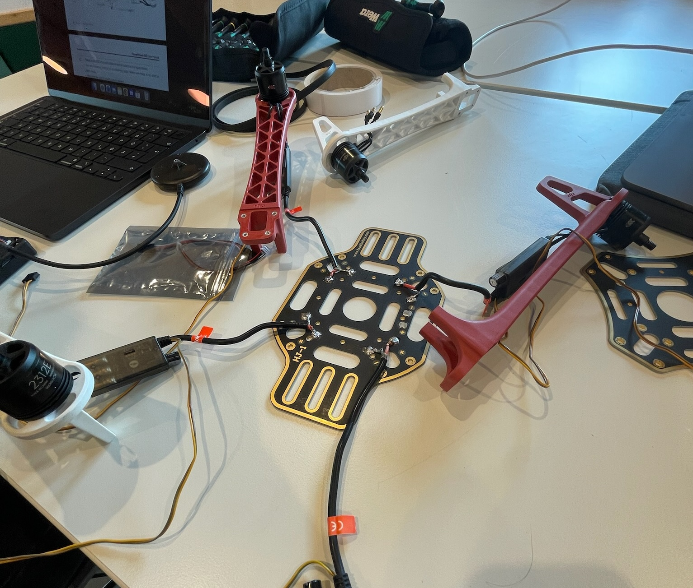
-  *Figure 1: Soldering the ESC power cables*

#### Step 2 – Mount the ESCs
- Secure each ESC along the inside of the frame arms using plastic clamps or zip ties.  
- Place them midway along the arm to keep wiring organized.
- 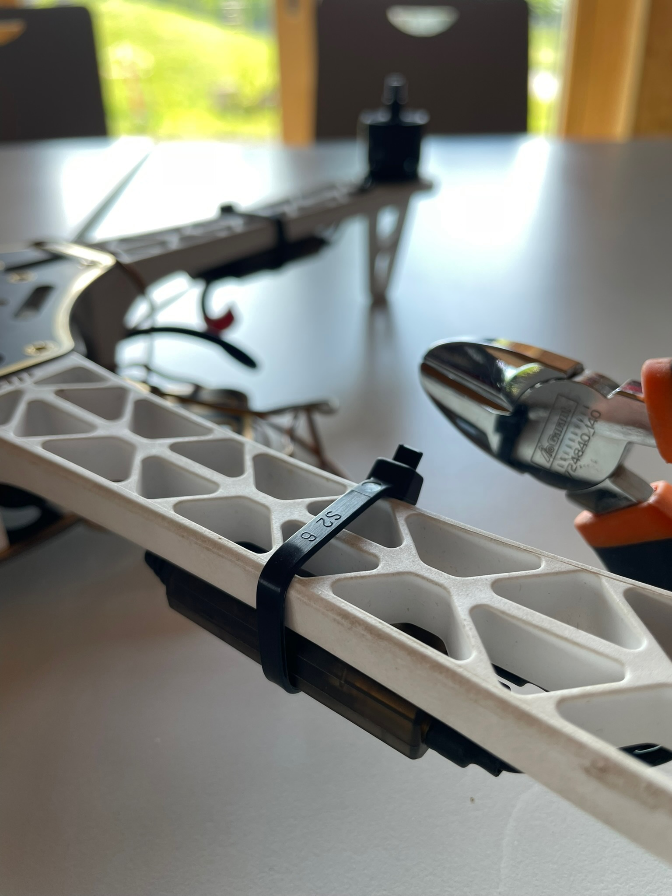
- *Figure 2: Securing the ESCs*

#### Step 3 – Assemble the Frames
- Separate the two white arms (450FAW) from the two red arms (450FAC).  
- Decide which color will mark the front of your drone (in our case: white = front, red = back).  
- Attach the legs of the arms to the PDB (bottom board) using screws.

#### Step 4 – Attach the Motors
- Fix each motor to the free end of a frame arm.  
- Connect each motor to its corresponding ESC.  
- Pay attention to motor orientation: two motors must rotate clockwise (CW) and two counter-clockwise (CCW).  
- Position them following Figure 3.  
- Do not mount the propellers yet.  
- 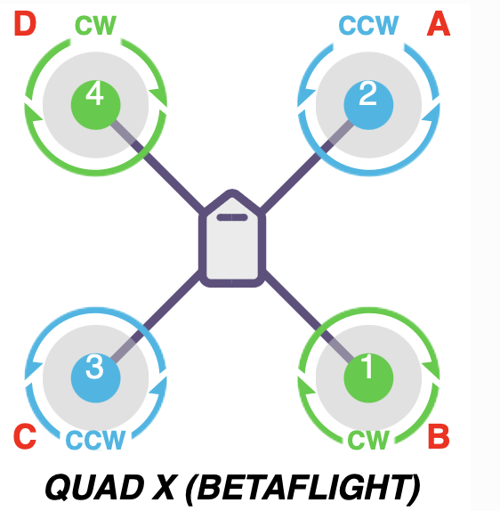
- *Figure 3:  Motors positioning (CW/CCW)*

#### Step 5 – Attach the Landing Legs
- Secure the four landing legs to the bottom board using screws.  
- Ensure they are firmly tightened and positioned evenly for stable landings.  
- Double-check that no wires are trapped between the legs and the frame.

#### Step 6 – Install the Companion Computer
- Place the companion computer between the boards.
- This module handles higher-level processing (e.g., vision tasks).  

#### Step 7 – Install the Top Board
- Place the top board onto the frame, above the arms and PDB (bottom board).  
- Secure it using screws to firmly close the frame structure.  
- Make sure all cables from the ESCs and power distribution board are routed properly before tightening, so they are not pinched or damaged.   

#### Step 8 – Mount the Flight Controller
- Fix the Pixhawk flight controller at the center-top of the frame using double-sided tape.  
- Ensure the orientation arrow points forward.  

#### Step 9 – Connect the ESCs to Pixhawk
- Connect the ESC signal wires to MAIN OUT 1–4 on the Pixhawk, in this case the side you plug each cable matters, but pins port is designed in a way that doesn't allow you to make a mistake. 
- Make sure each ESC is plugged into the correct output channel that corresponds to its motor position in the quadcopter layout.    
- 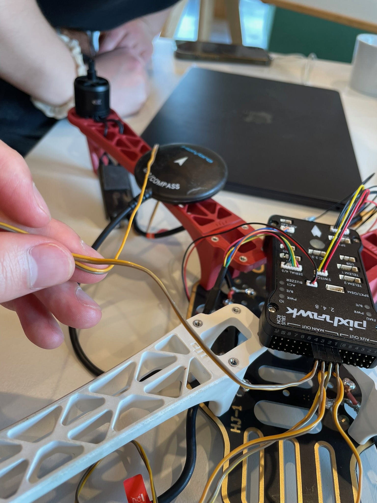  
*Figure 4: ESC to Pixhawk wiring*

#### Step 10 – Connect Peripherals
- **GPS module** → GPS port, I²C
- **Telemetry radio** → TELEM1   
- **Buzzer** → BUZZ port    
- Position devices so that no cables obstruct propellers. We 3D-printed a GPS mount for improved placement.
- 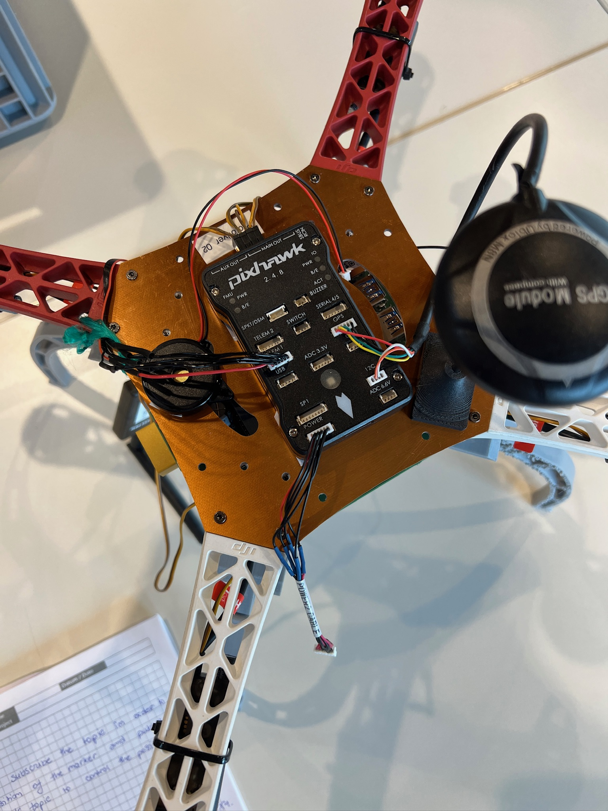  
*Figure 5: Connection of peripherals with the Flight Controller*

#### Step 11 – Final Checks
- Verify all screws are secure.  
- Ensure no wires touch the motors or propellers.  
- Confirm polarity one last time before connecting the battery.  
- Keep propellers off until configuration and motor tests are complete.

The assembly of our drone is still in progress; therefore, some additional steps and components will be added to these section. Detailed information about the PDB,and the battery will also be provided soon.

## Section 2 – Drone Configuration

Selecting the right flight controller can be a challenging task, as it must match the drone’s requirements and mission goals. For our build, we selected the Pixhawk 2.4.8, a reliable and well-documented option widely used in educational projects.

### 2.1 Pixhawk Overview
The **Pixhawk** is an open-hardware flight controller that serves as the “brain” of the drone. It interprets pilot commands and sensor data to regulate the motors, ensuring stable and responsive flight. The board integrates a variety of sensors that measure movement, orientation, and environmental data. Using this information, it continuously adjusts motor speeds to execute flight maneuvers. 

### Specifications
**Microprocessor**
- 32-bit STM32F427 Cortex M4 core with FPU
- 168 MHz / 256 KB RAM / 2 MB Flash
- 32-bit STM32F103 failsafe co-processor 

**Sensors**
- L3GD20 3-axis 16-bit gyroscope
- LSM303D 3-axis 14-bit accelerometer / magnetometer
- MPU 6000 3-axis accelerometer / gyroscope
- 5611 barometer 
 
**Interfaces**
- 5x UART (serial ports), one high-power capable, 2x with HW flow control
- 2x CAN
- S.BUS input and output
- PPM sum signal
- RSSI (PWM or voltage) input
- I2C
- SPI
- 3.3 and 6.6V ADC inputs
- External micro-USB port

**Power System**
- Ideal diode controller with automatic failover
- Servo rail high-power (7 V) and high-current ready
- All peripheral outputs over-current protected, all inputs ESD protected
**Weight and Dimensions**
- Weight: 38g (1.31oz)
- Width: 50mm (1.96")
- Thickness: 15.5mm (0.61")
- Length: 81.5mm (3.21")

### 2.2 Relationship of Pixhawk & PX4
The Pixhawk, running the PX4 autopilot stack, provides several advantages:
- A Unix/Linux-like programming environment  
- Advanced autopilot functions for flexible mission planning  
- Support for sophisticated mission scripting and flight behaviors  
- A custom PX4 driver layer ensuring precise timing across processes 

This combination makes Pixhawk 2.4.8 a robust platform for both learning and practical drone applications, enabling us to configure the drone for reliable flight and prepare it for the precision landing assignment. 

### 2.3 Connecting the Flight Controller
Connecting the flight controller turns the airframe into a controllable system: you’ll power the Pixhawk from the PDB, route ESC signal leads to the correct outputs, attach core peripherals (GPS, telemetry, buzzer), and verify orientation/safety before any tests.

- Power the Pixhawk (via power module/PDB): Connect the power module from the battery/PDB to the POWER port on Pixhawk. Verify the controller powers up (status LEDs) and delivers a stable ~5 V.  
- ESC signals to MAIN OUT 1–4:Plug each ESC’s signal/ground intoMAIN OUT 1–4 according to your motor layout (Motor 1→OUT1, Motor 2→OUT2, etc.).  
- Peripherals to the correct ports:  
  - GPS/Compass → GPS (and I²C if using an external compass)  
  - Telemetry radio → TELEM1  
  - Buzzer → BUZZ 
Mount Pixhawk flat at the center of gravity with the arrow pointing forward. Keep propellers off, secure/strain-relieve all cables, and ensure no wires can contact the motors or props.

### 2.4 Firmware Setup
- Install QGroundControl and open it.  
- Go to the Firmware section and follow the on-screen instructions.  
- Connect your computer to the Pixhawk using a micro-USB cable.
- 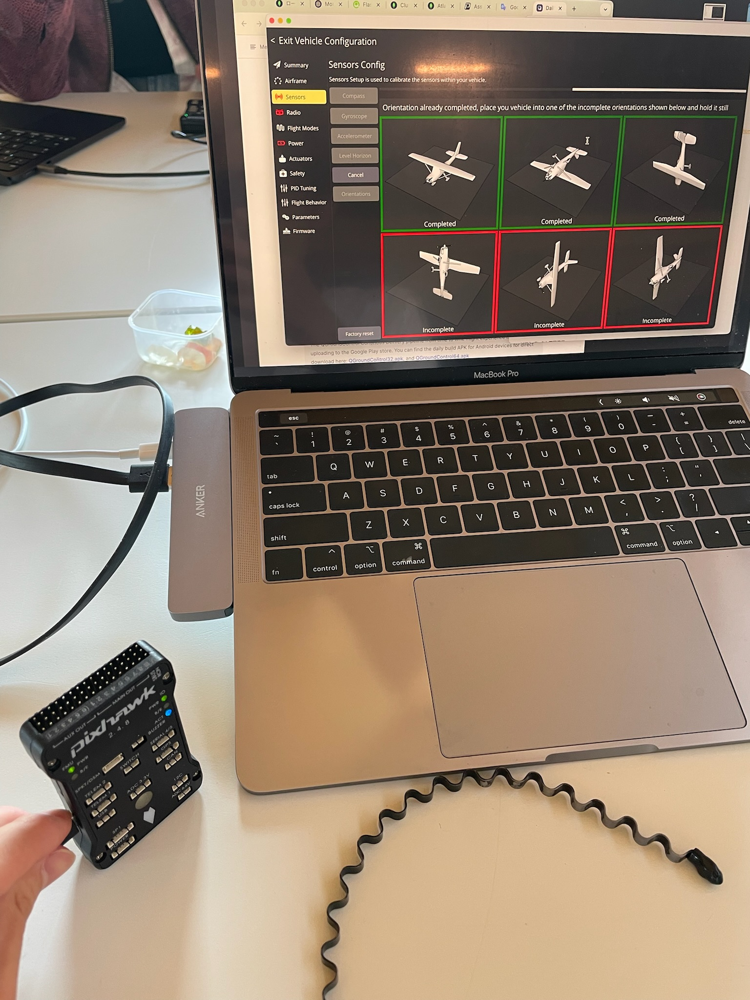
*Figure 6: Connection Pixhawk-Computer via cable*

- Update the firmware by selecting PX4 Pro v1.16.0 – Stable Release.
- 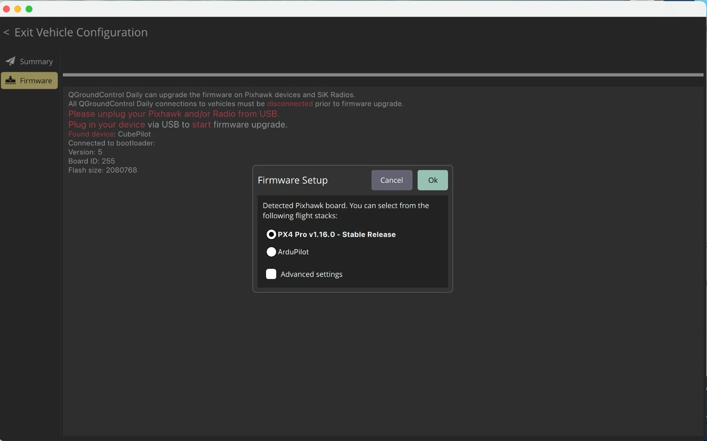
 *Figure 7: Firmware update in QGroundControl*

- Setup the Airframe, choose: "Generic Quadcopter". It is necessary to map the motors correctly.
- 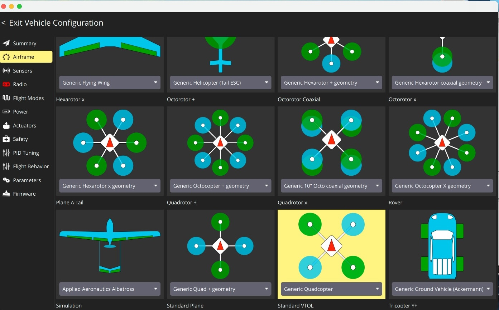
 *Figure 8: Airframe Setup*


### 2.5 Sensor Calibration
Sensor Setup is used to calibrate the sensors within your vehicle.To calibrate the sensors, follow the instruction for each of them starting from the compass calibration to the following sensors, the software will guide you to move your vehicle as required for each sensor.
- Compass calibration → rotate drone in all directions.
- Accelerometer calibration → place drone level, nose up, nose down, etc.
- Gyroscope calibration → performed automatically when stationary.
 
 Illustration from Compass Calibration:
- 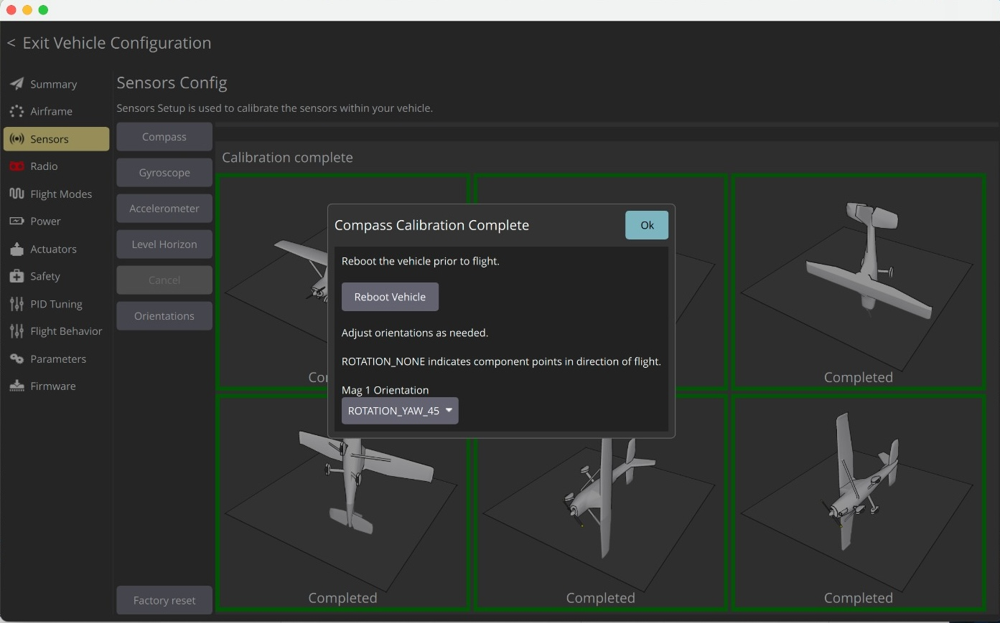
 *Figure 9: Compass Calibration*


### 2.6 Actuators Configuration 

- 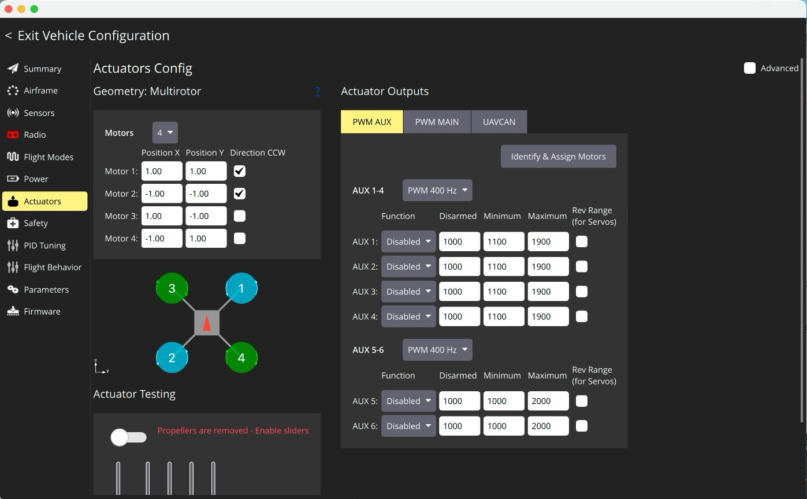
 *Figure 10: Actuator Setup – Before*  
- 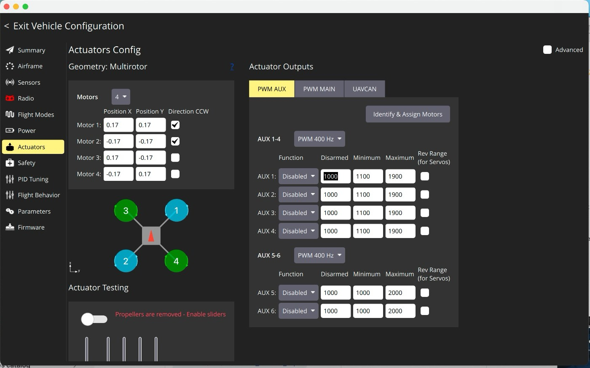
 *Figure 11: Actuator Setup – After the Configuration*  
  

### 2.7 Configuring Power Module
Enter the specifications of the battery you will use.
- 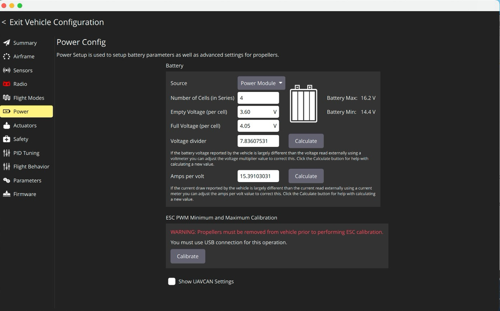
 *Figure 12: Power Module Configuration*


### 2.8 Parameter Settings

Proper parameter settings ensure the quadcopter can fly safely and respond correctly to commands. Parameters define how the flight controller interprets sensor data and generates motor outputs, and even small adjustments can significantly impact performance.
- PID gains (roll, pitch, yaw): These control how aggressively the drone corrects its orientation. In our build, we used the default PX4 values, as they are tuned for a generic quadcopter frame.  
- Battery failsafe voltage: This parameter triggers a warning or return-to-launch when the battery drops below a safe level, preventing mid-air power loss.  
- Return-to-launch altitude: Defines how high the drone climbs before returning to the home point, avoiding obstacles during automatic return.  
- Non-standard tweaks: No custom changes were applied beyond defaults, but the framework allows adjustment of parameters such as sensor filtering, GPS accuracy thresholds, and logging rates if required.  

For our project, we primarily relied on the default PX4 settings, which are sufficient for stable flight in a controlled lab environment.    

### 2.9 Final Checks
- Verifying all connections  
- Ensuring firmware and parameters are updated  
- Running initial test flights without propellers
- Perform a motor test in QGroundControl (without props).  
- Check that motor directions (CW/CCW) match the airframe setup.  
- Verify GPS lock before arming. 


# Section 3 – Drone Programming

## 3.1 Overview

This section explains the software implementation of **precision landing on an ArUco marker** using **ROS 2 ↔ PX4**. We describe the topic pipeline (detector → bridge → controller), the **finite-state machine (FSM)** controller, and two key design choices added during integration:

1. **Guided-search** (home toward a just-visible marker),
2. **Exclusive stick ownership** (our node publishes ManualControlSetpoint continuously so that PX4 selects our inputs over QGC/RC).

We conclude with results, known limitations, and concrete improvements.


---

## 3.2 Architecture (ROS 2 / PX4)

**Nodes & topics**

* **Detector** `eolab_precision_landing/detector`

  * Sub: `/protoflyer/image`, `/protoflyer/camera_info`
  * Pub: `/protoflyer/detected_aruco_markers` (\~30 Hz), `/protoflyer/aruco_debug_image`

* **Bridge** `project_report/marker_to_error`

  * Sub: `/protoflyer/detected_aruco_markers`
  * Pub:
    `/protoflyer/eolab/precision_landing/visible` *(std\_msgs/Bool)*,
    `/protoflyer/eolab/precision_landing/error` *(geometry\_msgs/Vector3, meters)*
  * Effective params: `scale=0.04`, `flip_z=true`, `forward_axis="z"`, `altitude_axis="y"`, `smooth_n=3`

* **Controller** `project_report/landing_controller`

  * Sub: `/protoflyer/eolab/precision_landing/{visible,error}`, `/protoflyer/fmu/out/vehicle_control_mode`
  * Pub: `/protoflyer/fmu/in/manual_control_input` *(px4\_msgs/ManualControlSetpoint)*
  * Srv: `/eolab/landing_controller/start` *(std\_srvs/SetBool)*

**Axis mapping (after the bridge)**

* Lateral: `roll  ← +err.x`, `pitch ← -err.z`
* Altitude: `throttle` is controlled around hover using `err.y` (positive = “too high”).


---

## 3.3 Mission logic (FSM)

`WAIT → SEARCH → ALIGN → DESCEND → FINE_ALIGN → LAND`

* **SEARCH** – Yaw scan + small **orbit/spiral**. If marker becomes visible, **guided-homing** (proportional roll/pitch toward the marker) runs immediately; once visible for `align_dwell` seconds, transition to ALIGN.
* **ALIGN** – Lateral P control using `kp_xy`, clipped by `max_tilt_cmd` until within `coarse_align_xy`.
* **DESCEND** – Apply `descend_throttle` (below hover) while maintaining lateral centering; if within `fine_align_xy` (or close in altitude), go to FINE\_ALIGN.
* **FINE\_ALIGN** – Tight lateral bounds, slightly lower throttle.
* **LAND** – Use `land_throttle_min` (floor); lateral commands softened. A **notch-down** routine reduces throttle further if altitude progress stalls near ground.

Safety: if the marker is lost longer than `lost_timeout`, the controller reverts to **SEARCH** and commands **hover**.

---

## 3.4 Implementation highlights

### A) Exclusive stick ownership (PX4 acceptance)

To prevent QGC/RC from overriding descent, the controller **always publishes** (even when not engaged, it can send hover if `idle_hover=true`) with:

* `data_source = MAVLINK_0 (2)`
* `sticks_moving = true`
* High rate: `rate_hz = 75–100`

This reliably makes `/fmu/out/manual_control_setpoint` follow our `/fmu/in/manual_control_input`.

**Snippet (publishing sticks)**

```py
# 0..1 -> [-1..1] mapping for PX4 throttle stick
throttle_px4 = 2.0 * clamp(cmd_z, 0.0, 1.0) - 1.0

msg = ManualControlSetpoint()
msg.pitch    = clamp(cmd_x, -1.0, 1.0)
msg.roll     = clamp(cmd_y, -1.0, 1.0)
msg.yaw      = clamp(cmd_r, -1.0, 1.0)
msg.throttle = clamp(throttle_px4, -1.0, 1.0)

msg.valid = True
msg.data_source = 2          # MAVLINK_0
msg.sticks_moving = True     # keep ownership
pub.publish(msg)
```

### B) Guided-search (snappier acquisition)

During **SEARCH**, if the marker is even briefly visible, we immediately bias roll/pitch toward the marker (plus mild yaw centering). This reduces “spinning in place”.

**Snippet (SEARCH state)**

```py
if visible:
    cmd_x = clamp(kp_xy * homing_gain * (-err.z), -max_tilt, max_tilt)
    cmd_y = clamp(kp_xy * homing_gain * ( err.x), -max_tilt, max_tilt)
    cmd_r = clamp(search_yaw_kp * (-err.x), -max_yaw, max_yaw)
    if visible_for >= align_dwell:
        transition(ALIGN)
else:
    # orbit scan
    ang = 2*pi*orbit_hz*t
    cmd_x = -orbit_tilt * sin(ang)
    cmd_y =  orbit_tilt * cos(ang)
    cmd_r = clamp(search_yaw_rate, -max_yaw, max_yaw)
```

### C) Stall-aware descent near ground

If altitude (from `err.y`) does not improve for a short dwell, we **notch down** `descend_throttle` (never below `land_throttle_min`) to ensure continued descent.

**Snippet (DESCEND → notch-down)**

```py
cmd_z = descend_throttle
if abs(err.y - last_alt_err) < 0.01 and stalled_for > 0.8:  # <1 cm in 0.8 s
    descend_throttle = max(land_throttle_min, descend_throttle - 0.02)
    cmd_z = descend_throttle
```


---

## 3.5 Key parameters (typical working ranges)

### Additional knobs for transitions & vertical lock

To slow down state transitions and avoid premature descent...:

- `align_enter_visible_dwell` — minimum continuous-visibility time to go **SEARCH → ALIGN**.
- `coarse_dwell` / `fine_dwell` — additional dwell before **ALIGN → DESCEND** and **DESCEND → FINE_ALIGN**.
- `yaw_freeze_xy` — freeze yaw near the center to prevent sideways drift while correcting XY.
- *(Optional, if your controller version implements it)* `vertical_lock_xy` and `vertical_lock_dwell` — only permit vertical descent when XY is within a tight radius for a short dwell; otherwise keep focusing on lateral centering.

* **Rates & ownership:** `rate_hz=75–100`, `exclusive_mode=true`, `idle_hover=true`, `data_source=2`
* **Lateral:** `kp_xy=1.2–1.6`, `max_tilt_cmd=0.7–0.8`
* **Throttle (internal 0..1 → PX4 \[-1..1]):**
  `hover_throttle≈0.48–0.55`, `descend_throttle≈0.30–0.36`, `land_throttle_min≈0.20–0.24`
* **Thresholds & dwells:**
  `coarse_align_xy≈0.30`, `fine_align_xy≈0.12–0.16`, `land_z_thresh≈0.16–0.18`,
  `align_enter_visible_dwell≈0.15–0.25`, `coarse_dwell≈0.3`, `fine_dwell≈0.3`
* **Search & homing:** `search_mode=orbit`, `search_orbit_tilt≈0.16`, `search_orbit_hz≈0.20`,
  `search_yaw_rate≈0.6`, `search_homing_gain≈0.9`, `search_yaw_kp≈0.6`
* **Bridge:** `scale=0.04`, `flip_z=true`, `forward_axis="z"`, `altitude_axis="y"`, `smooth_n=3`

---

## 3.6 How to run (reproducible steps)

### SAFE mode (search-timeout RTL)

If the controller is engaged but the marker is **never detected** within a timeout window(), the node enters **SAFE** and commands **Return-to-Launch (RTL)**. Set:

- `search_timeout_s` — seconds from *engage* until SAFE triggers if marker never appears (e.g., `10.0`).
- `safe_action` — what to do on SAFE: `rtl` (default), `hover`, or `disengage`.

Implementation details:
- Sends `VEHICLE_CMD_NAV_RETURN_TO_LAUNCH` (RTL) on `/protoflyer/fmu/in/vehicle_command` for ~1.5 s at ~10 Hz to improve reliability.
- If AUTO mode is not accepted within ~2 s, it **falls back** to `VEHICLE_CMD_NAV_LAND` (AUTO.LAND), which is useful indoors or when home is invalid.
- You can override the vehicle-command topic with param `cmd_topic` if your namespace differs.

### Quick-start commands (drop-in)

> Paste these into separate terminals once PX4 and your simulation/world are running!

**1) PX4/Gazebo with ArUco world (start first) :**

```bash
cd ~/eolab_ws
source install/setup.bash
ros2 launch eolab_bringup start.launch.py world:=aruco
```


**2) ArUco detector :**

```bash
cd ~/eolab_ws
source install/setup.bash
ros2 run eolab_precision_landing detector --ros-args -r __ns:=/protoflyer
```


**3) Bridge (`project_report/marker_to_error`):**

```bash
cd ~/eolab_ws
source install/setup.bash
ros2 run project_report marker_to_error --ros-args \
  -p markers_topic:=/protoflyer/detected_aruco_markers \
  -p visible_topic:=/protoflyer/eolab/precision_landing/visible \
  -p error_topic:=/protoflyer/eolab/precision_landing/error \
  -p scale:=0.04 -p flip_z:=true \
  -p forward_axis:='"z"' -p altitude_axis:='"y"' \
  -p smooth_n:=5 -p publish_rate_hz:=30.0 -p stale_timeout_s:=0.6
```


**4) Controller (`project_report/landing_controller`):**

```bash
cd ~/eolab_ws
source install/setup.bash
ros2 run project_report landing_controller --ros-args \
  -p mapping_mode:=sm -p rate_hz:=100.0 \
  -p kp_xy:=1.2 -p kp_yaw:=0.6 \
  -p yaw_freeze_xy:=0.10 \
  -p max_tilt_cmd:=0.60 -p max_yaw_rate:=0.25 \
  -p hover_throttle:=0.55 -p descend_throttle:=0.43 -p land_throttle_min:=0.38 \
  -p coarse_align_xy:=0.30 -p fine_align_xy:=0.12 \
  -p land_z_thresh:=0.50 -p use_z_gate:=false \
  -p align_enter_visible_dwell:=0.10 -p coarse_dwell:=0.25 -p fine_dwell:=0.25 \
  -p vertical_lock_xy:=0.07 -p vertical_lock_dwell:=0.15 \
  -p lost_timeout:=1.2 -p lost_grace_s:=1.2 \
  -p search_mode:=orbit -p search_orbit_hz:=0.05 -p search_orbit_amp:=0.25 \
  -p search_yaw_rate:=0.25 \
  -p search_timeout_s:=10.0 -p safe_action:=rtl \
  -r /eolab/precision_landing/visible:=/protoflyer/eolab/precision_landing/visible \
  -r /eolab/precision_landing/error:=/protoflyer/eolab/precision_landing/error
```


**5) Engage autonomy:**

```bash
cd ~/eolab_ws
source install/setup.bash

# Engage (start autonomy)
ros2 service call /eolab/landing_controller/start std_srvs/srv/SetBool "{data: true}"

# Disengage (stop autonomy)
ros2 service call /eolab/landing_controller/start std_srvs/srv/SetBool "{data: false}"
```


**6) Quick verification: Monitoring (separate terminals):** 

```bash
cd ~/eolab_ws
source install/setup.bash

# Bridge outputs
ros2 topic echo /protoflyer/eolab/precision_landing/visible
ros2 topic echo /protoflyer/eolab/precision_landing/error

# MCP input and PX4 adoption
ros2 topic echo /protoflyer/fmu/in/manual_control_input | egrep 'roll:|pitch:|yaw:|throttle:'
ros2 topic echo /protoflyer/fmu/out/manual_control_setpoint | egrep 'roll:|pitch:|yaw:|throttle:'

# Flight mode flags (after SAFE/RTL, expect auto=true)
ros2 topic echo /protoflyer/fmu/out/vehicle_control_mode | egrep 'manual|auto|offboard'

# Altitude trend (confirm descent)
ros2 topic echo /protoflyer/fmu/out/vehicle_local_position | egrep 'z:|vz:'
```


---

## 3.7 Results (current)

### Flight scenarios (sim)

1) **Directly above the marker, then engage** → The drone aligned and descended straight down onto the tag (LAND succeeded).
   
2) **Offset but marker visible, then engage** → The drone performed a guided search around the marker (orbit-like “petal” pattern) before tightening in and beginning descent. 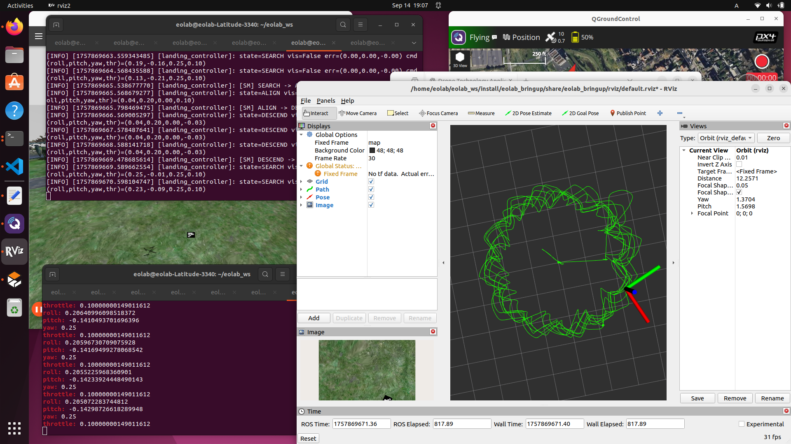 

3) **Far from the marker** → The marker was not found within the timeout window, SAFE triggered, and the vehicle executed RTL (or fallback LAND depending on environment/config).

* **Detection & bridging** stable (debug overlay + MarkerArray consistent).
* **Guided-search** shortens time to center; ALIGN/DESCEND transitions behave as intended.
* With **exclusive mode**, PX4 **accepts** our ManualControlSetpoint; QGC/RC no longer cancels descent.
* **Touchdown** is *intermittent* and depends on hover/descend/land throttle calibration and visibility near ground.
* Our flight simulation can be viewed from this link: [Video](<https://youtu.be/ko2bprU4g4M>)

---

## 3.8 Limitations

* **Auto-hover calibration** (pre-flight sweep to estimate true hover).
* **Land detector integration** (`/vehicle_land_detected`) to cut outputs at touchdown.
* **Blended altitude P-term** (use `kp_z` around hover on top of fixed descend).
* **Adaptive smoothing** in the bridge (`smooth_n` 1–3) based on detection jitter.
* **Robust visibility gating** at very low altitude (require small dwell before LAND).

---

## 3.9 Improvements (planned)

* **Auto-hover calibration** (pre-flight sweep to estimate true hover).
* **Land detector integration** (`/vehicle_land_detected`) to cut outputs at touchdown.
* **Blended altitude P-term** (use `kp_z` around hover on top of fixed descend).
* **Adaptive smoothing** in the bridge (`smooth_n` 1–3) based on detection jitter.
* **Robust visibility gating** at very low altitude (require small dwell before LAND).

---

## 3.10 Troubleshooting (common pitfalls)

**SAFE triggers but vehicle does not return**  
- Verify the vehicle-command topic (`/protoflyer/fmu/in/vehicle_command`) matches your setup (`cmd_topic` param can override).
- Ensure AUTO missions are permitted and *RTL* is allowed in your environment (GPS/home valid, no geofence violation).  
- The controller resends RTL for a brief window and then falls back to **AUTO.LAND** if AUTO is not accepted; check logs to confirm the fallback engaged.

* `/fmu/out/manual_control_setpoint` stuck at zeros → PX4 not adopting inputs.

  * Ensure **Manual/POSCTL** (manual=true, auto/offboard=false).
  * Disable **QGC Joystick**; set **`COM_RC_OVERRIDE=1`**.
  * Run controller with `exclusive_mode=true, rate_hz≥75`.
* Marker briefly visible but no transition → increase `align_enter_visible_dwell` to `0.25–0.35`.
* Descent stalls near ground → lower `land_throttle_min` by 0.02 steps; confirm notch-down logs.

---

## 3.11 Final Comment

> In our tests, when the controller was engaged directly over the ArUco marker, the drone aligned and descended onto the tag reliably. However, when engagement began with a lateral offset (marker not centered), the vehicle occasionally diverged from the marker during SEARCH/ALIGN and, in some cases, landed on ground without a marker. This reflects the current ManualControlSetpoint approach and loss-handling; stricter LAND gating and Offboard velocity setpoints are planned as future work.


## Table of Figures

| Figure | Description                                  |
|--------|----------------------------------------------|
| 1      | Soldering the ESC power cables               |
| 2      | Securing the ESCs                            |
| 3      | Motors positioning (CW/CCW)                  |
| 4      | ESC to Pixhawk wiring                        |
| 5      | Connection of peripherals with the Flight Controller |
| 6      | Connection Pixhawk-Computer via cable        |
| 7      | Firmware update in QGroundControl            |
| 8      | Airframe Setup                               |
| 9      | Compass Calibration                          |
| 10     | Actuator Setup - Before                      |
| 11     | Actuator Setup – After the Configuration*    |
| 12     | Power Module Configuration                   |
| 13     | Drone test02 with "petal" pattern            |

